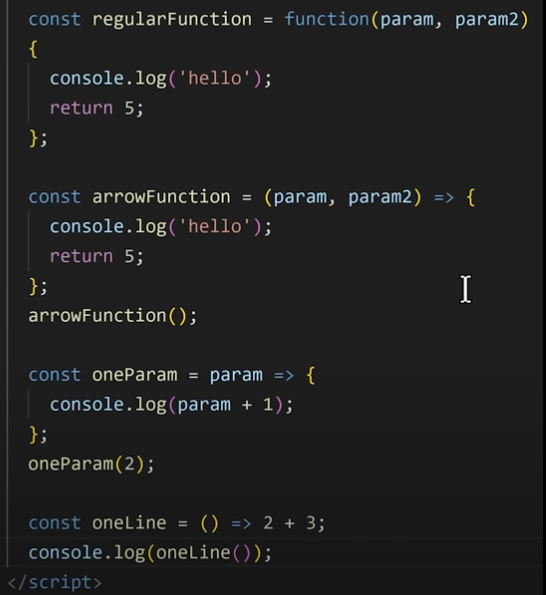
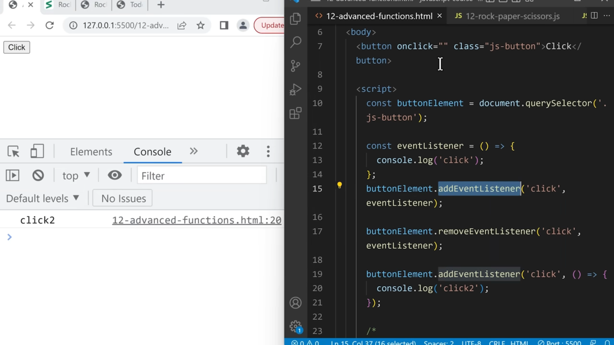
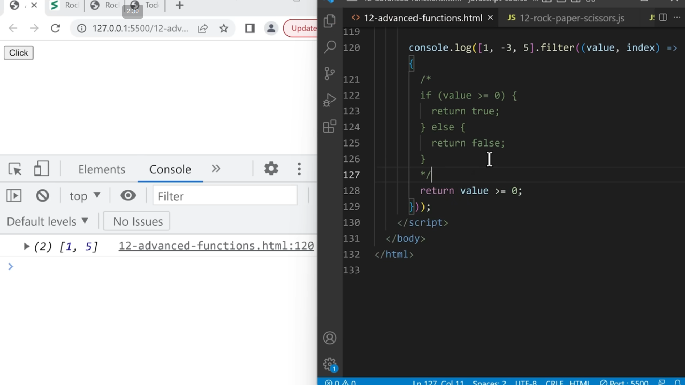
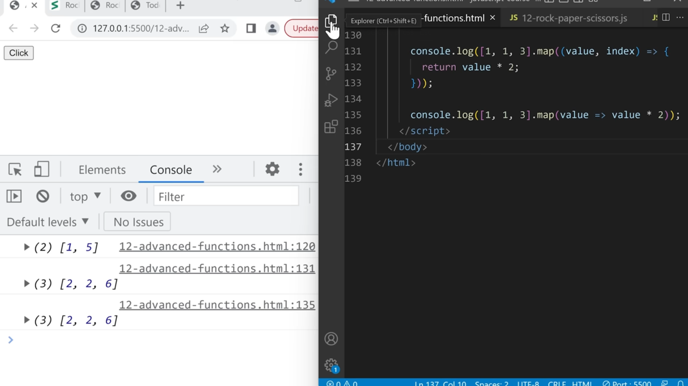
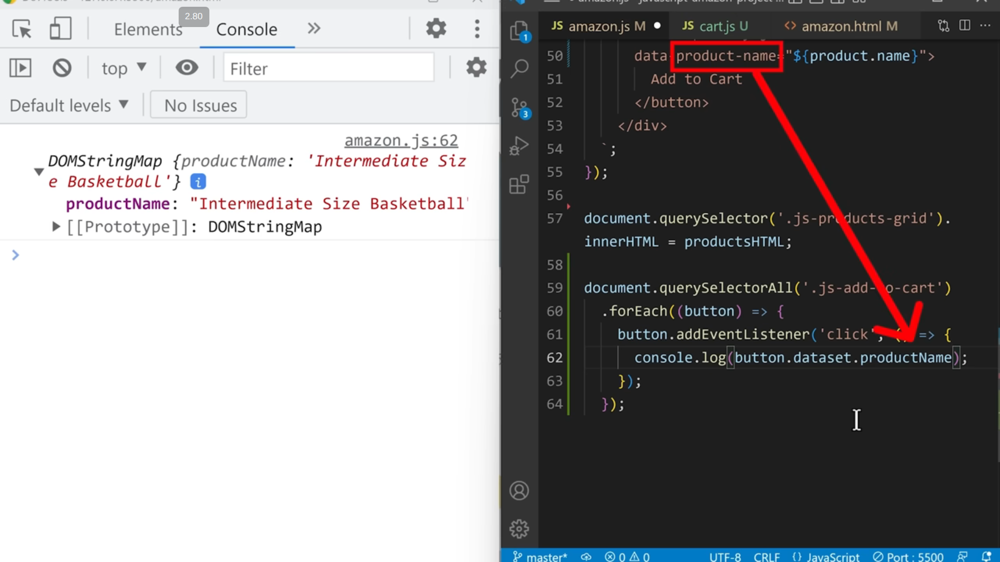

# Notes
  Some Notes While Reviewing JS.
   
  I don't care about the preview of this md file.

## Json
    Keys must be in double quotes (" ").
    Values can be:
    string ("hello")
    number (123)
    boolean (true / false)
    null
    array ([])
    object ({})
    No functions, no comments, no variables.
    {
      "name": "Ahmed",
      "age": 21,
      "skills": ["JavaScript", "React", "Node.js"],
      "isStudent": true
      }

## Objects
    Keys can be unquoted (if they are valid identifiers).
    Values can be anything: strings, numbers, arrays, objects, functions, symbols, etc.
    You can add methods, variables, and dynamic properties.

    const user = {
      name: "Ahmed",
      age: 21,
      skills: ["JavaScript", "React", "Node.js"],
      isStudent: true,
      greet: function() {
        console.log("Hello " + this.name);
      }
    };

    JSON.stringify(myObject) => converts it to Json
    JSON.parse(myJson) => converts to JS Object

## Note
    localStorage only supports strings.

## undefined vs null
    function func(parameter = 'default') {
      console.log(parameter);
    }
    func();           => 'default'
    func(undefined);  => 'default'
    func(null);       =>  null

## objects
    const object1 = {
      message: 'hello',
      price: 799
    };  
    const object2 = object1; //Copy by Reference (arrays also)

    object1.message = 'Good job!';
    console.log(object1); // 'Good job!'
    console.log(object2); // 'Good job!'

    const object3 = {
      message: 'Good job!',
      price: 799
    };

    console.log(object1 === object3); // false, because they have different references.

## innerHTML vs innerText
    innerHtml = 
Hello
 => insert a paragraph. (parses the html, and displays it)
    innerText = inserts text.

## Array
    typeof [1, 2] => object //Array are objects.
    Array.isArray(myArray).
    myArray.push
    myArray.splice()

## Arrow Functions

## Even Listeners
  Adding & Removing Event Listeners
  
    so here "click" wasn't printed out because the first eventListener was removed.

## Array Filter
  

## Array Map
  

## Data Attribute
  
  use in HTML cebab case, in JS dataset.camelCase.

