# Notes
This are some JS notes, like a cheat-sheet.


## [Inheritance | Prototype | Proto](https://www.youtube.com/watch?v=jnME98ckDbQ&list=PL1PqvM2UQiMoGNTaxFMSK2cih633lpFKP&index=3)
### Notes
* `object.__proto__ === className.prototype`
* prototype chain: when calling a method or a property, it first looks for it top level (current object), then goes to next prototype, then next... etc 
* 2 types of properties, one that belongs to the constructor (class) and get inherited for all objects (like "Egyptian"), and one that doesn't belong to the constructor, and is unique to each object (like "myName").
* C++ → Fast but heavier:
Uses class-based inheritance with a fixed memory layout — each object contains all parent data and methods, making it faster but uses more memory.
* C++ → Fast but heavier:
Uses class-based inheritance with a fixed memory layout — each object contains all parent data and methods, making it faster but uses more memory.
* JavaScript → Flexible but slower:
Uses prototype-based inheritance where objects share methods via prototypes — this makes it more memory-efficient but slower due to runtime lookups.
* Factory Function → A regular function that creates and returns an object.

CODE 1
```js
// This is a constructor function, and yea it's outside a class.
// This is old practice
function Person() {
  this.talk = _ => "talking"
  // talk method (it's a property) is not on the Person class, it just gets copied to new objects 
  // so here there is inheritance, like if I change myObj.talk() won't change.
  // also not eff, as it gets copied on all the objects
}
```
CODE 2
```js
function Person2() {
}
// talk method doesn't get copied on children
Person2.prototype.talk = _ => "talking2";
```
<br>
<br>
<br>
<br>

## factory functions, constructor functions, and classes
### Factory Function
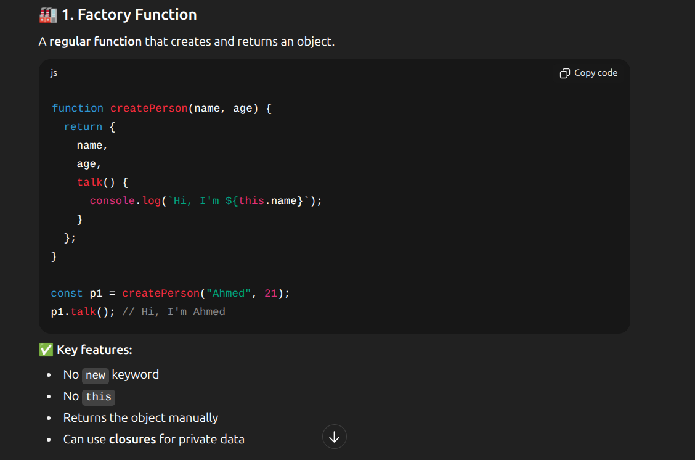

### Constructor Function
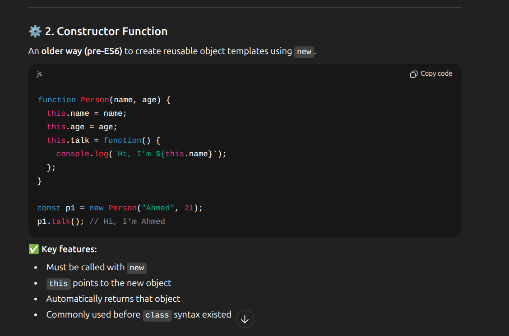
Behind The Scene (Next Img)
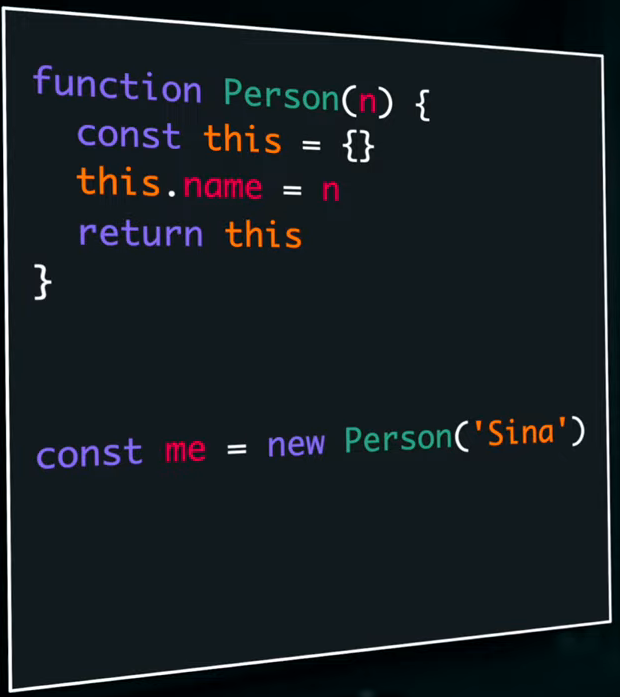


### Class
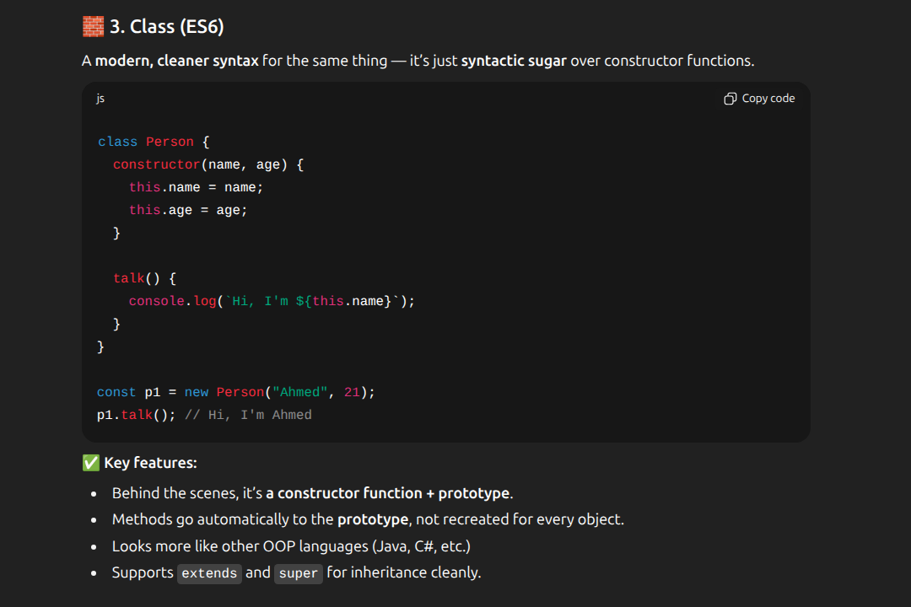

### 
* In constructor functions, if you define methods inside the function, each object gets its own copy.

* In classes, methods live in the prototype, so all instances share the same function reference.

* Both can do inheritance, but classes make it much simpler and cleaner.

<br>


<br>
<br>
<br>
<br>
<br>
<br>
<br>
<br>


## Json
Keys must be in double quotes (" ").  
Values can be:
- string ("hello")
- number (123)
- boolean (true / false)
- null
- array ([])
- object ({})

```json
{
  "name": "Ahmed",
  "age": 21,
  "skills": ["JavaScript", "React", "Node.js"],
  "isStudent": true
}
```

* No functions, no comments, no variables.
* localStorage only supports strings.


## Objects
Keys can be unquoted (if they are valid identifiers).  
Values can be anything: strings, numbers, arrays, objects, functions, symbols, etc.  
You can add methods, variables, and dynamic properties.

```js
let country = "Egypt";
const user = {
  name: "Ahmed",
  age: 21,
  country: country, //Variable declared above
  skills: ["JavaScript", "React", "Node.js"],
  isStudent: true,
  greet: function() {
    console.log("Hello " + this.name);
  }
};

JSON.stringify(myObject) // converts to JSON
JSON.parse(myJson) // converts to JS Object
```


## undefined vs null
```js
function func(parameter = 'default') {
  console.log(parameter);
}
func();           // 'default'
func(undefined);  // 'default'
func(null);       // null
```


## objects (reference behavior)

```js
const object1 = { message: 'hello', price: 799 };  
const object2 = object1; // Copy by Reference (arrays also)

object1.message = 'Good job!';
console.log(object1); // 'Good job!'
console.log(object2); // 'Good job!'

const object3 = { message: 'Good job!', price: 799 };
console.log(object1 === object3); // false (different references)
```


## innerHTML vs innerText
- `innerHTML = "<p>Hello</p>"` → inserts a paragraph (parses HTML)
- `innerText` → inserts text only.


## Array
```js
typeof [1, 2] // object (arrays are objects)
Array.isArray(myArray)
myArray.push()
myArray.splice()
```


## Arrow Functions


## Event Listeners
Adding & Removing Event Listeners  


## Array Filter


## Array Map


## Data Attribute


* Use kebab-case in HTML, camelCase in JS (`dataset.camelCase`).


## Testing
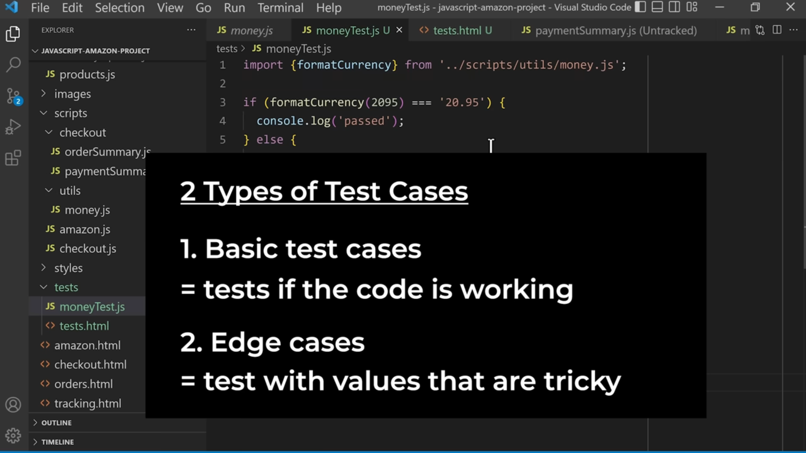  
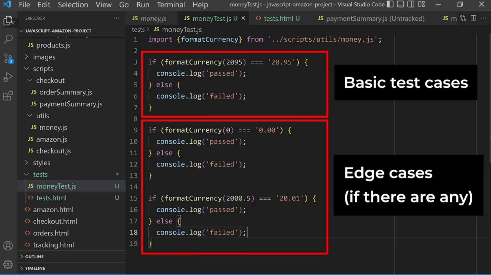  
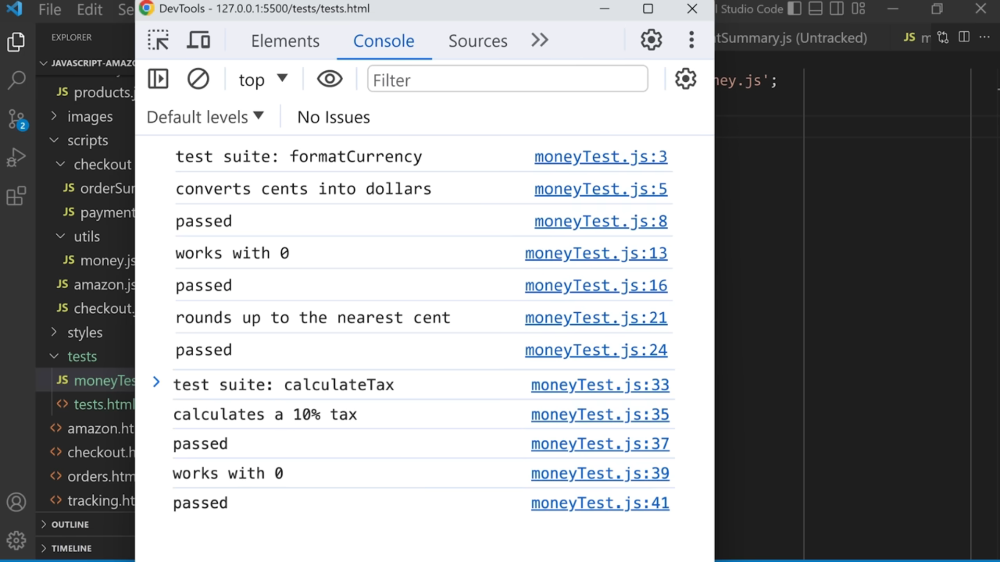


## Testing Frameworks (Jasmine)
- `describe()` → create test suite  
- `it()` → create test  
- `expect().toEqual()` → assertion  
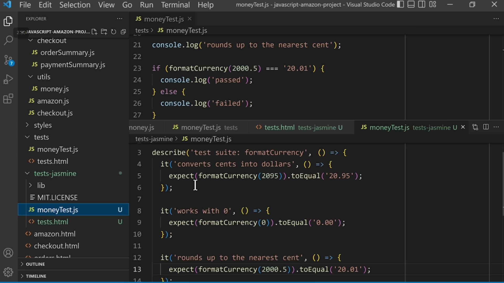  
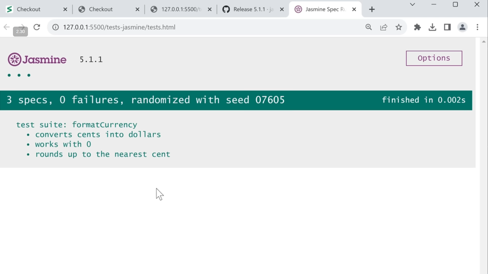


## OOP
### Constructor  
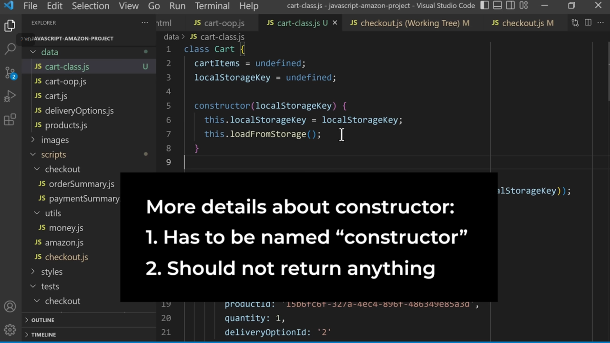

* Private properties (prefix with `#` and use inside the class)  
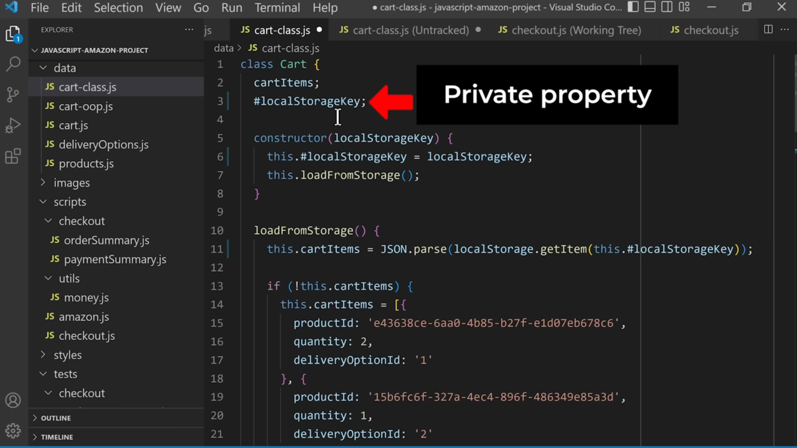


## This Keyword
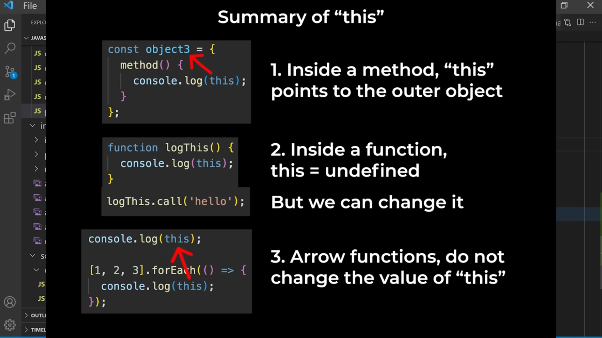


## XMLHttpRequest

```js
let xhr = new XMLHttpRequest();

xhr.open("GET", "https://supersimplebackend.dev/hello");
xhr.send();

xhr.addEventListener("load", () => {
  console.log(xhr.response);
});
```

### Network Tab


### Status Code
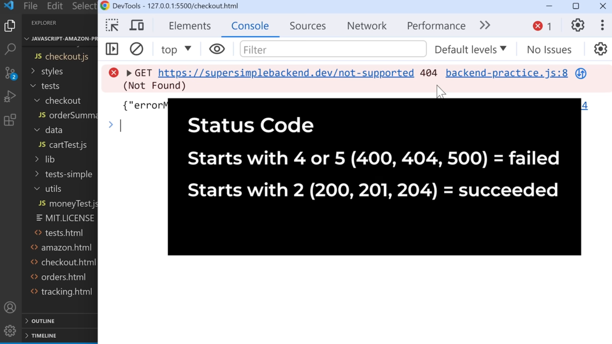

- **4xx** → client error (bad request, not found)
- **5xx** → server error (crash, internal error)


### API


## Async JavaScript & Callback Functions | Color Code

### Callback Hell Example

```js
function orderPizza(callback) {
  setTimeout(() => {
    console.log("Pizza Ordered");
    callback();
  }, 1000);
}

function deliverPizza(callback) {
  setTimeout(() => {
    console.log("Pizza Delivered");
    callback();
  }, 1000);
}

function eatPizza(callback) {
  setTimeout(() => {
    console.log("Eating Pizza");
    callback();
  }, 1000);
}

// Callback Hell
orderPizza(() => {
  deliverPizza(() => {
    eatPizza(() => {
      console.log("Ate Pizza, everything is done.");
    });
  });
});
```


Another Example:

```js
console.log("Hi");

function walkDog(callback) {
  setTimeout(() => {
    console.log("You walk the dog");
    callback();
  }, 1500)
}

function cleanKitchen(callback) {
  setTimeout(() => {
    console.log("You clean The kitchen");
    callback();
  }, 2500)
}

function takeOutTrash(callback) {
  setTimeout(() => {
    console.log("You take out trash");
    callback();
  }, 500)
}

walkDog(() => {
  cleanKitchen(() => takeOutTrash(() => {
    console.log("You Finished All The Chores!")
  }));
});
```


## Promises
[promise-execution](https://www.lydiahallie.com/blog/promise-execution)  
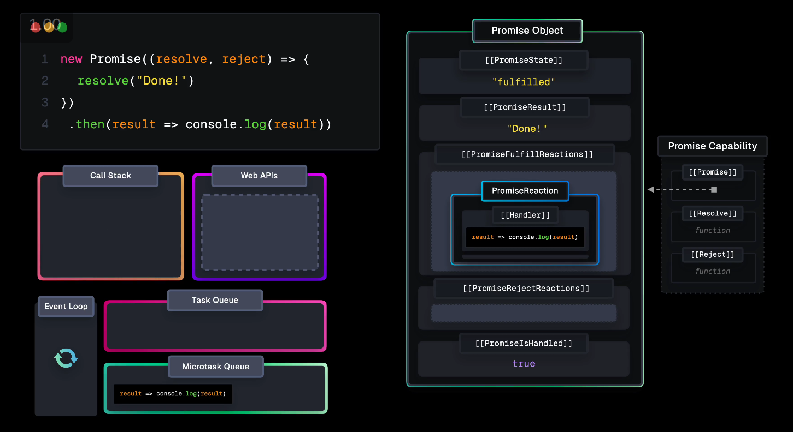

**Note:**  
`.catch()` recovers the chain by turning the error into a resolved value (unless you rethrow).  
Meaning `.then()` after `.catch()` still executes by default.


## Async Await
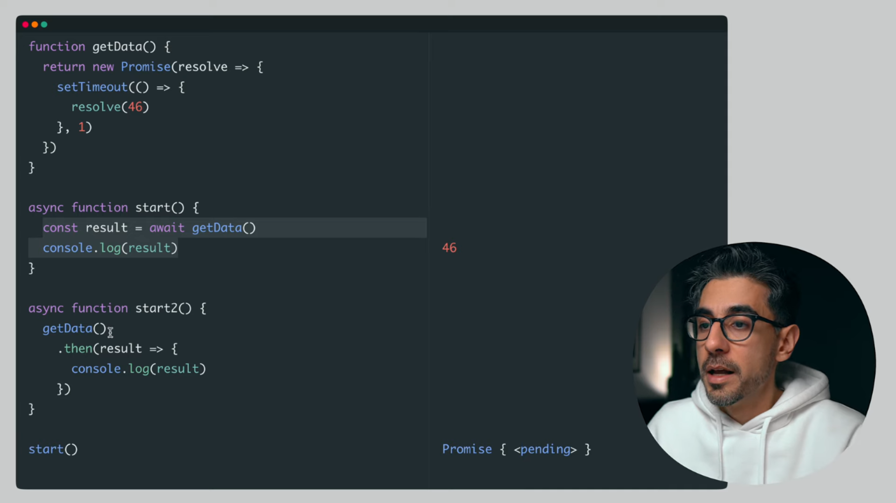  
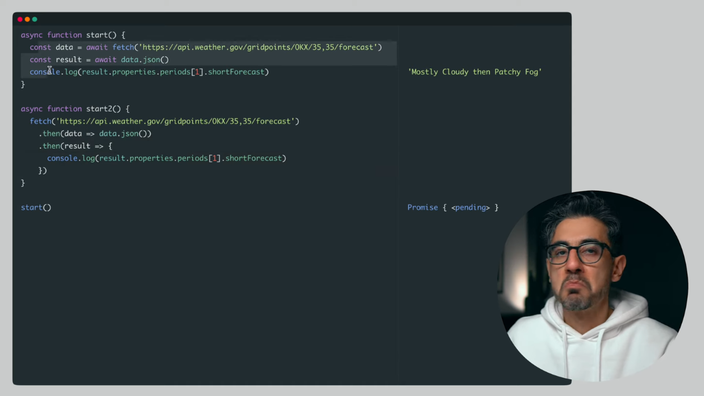

We use `try/catch` instead of `.catch()` to handle errors more clearly.  
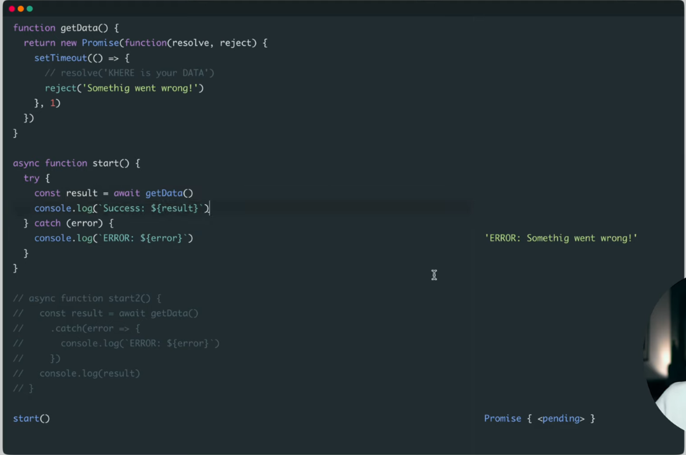


## [🌐 Fetch - Explanation & Examples](https://youtu.be/ubw2hdQIl4E?si=Y1PHheBddQmECimR)

* When you call `fetch(URL)`, JavaScript creates a **request** behind the scenes and sends it.  
  This is how it works under the hood:

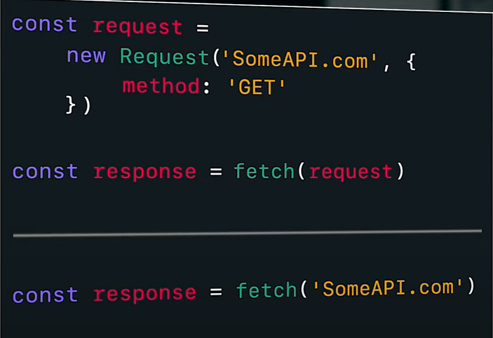

---

### 📌 Example
Basic fetch example:

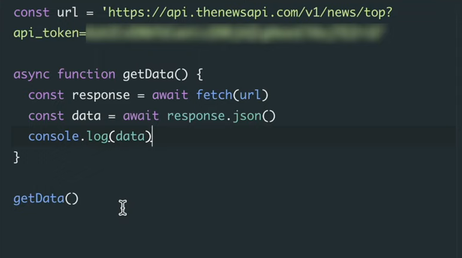


### 📌 `Response.json()` (Summary)

- **What it is:**  
  A method of the `Response` object returned by `fetch()`.

- **What it does:**  
  - Reads the response **body stream** asynchronously  
  - Parses it as JSON  
  - Returns a **Promise** that resolves to a JS object (or array)

- **Usage:**
```js
const response = await fetch(url);
const data = await response.json();
```

- **Why it's async:**  
  The body might still be downloading when you call `.json()`, so it must wait for it to finish before parsing.

- **Common mistake:**  
  Forgetting `await`, which gives you a **Promise** instead of the actual object.
---

### ✅ Successful Fetch (Promise Resolved)
In this case, the fetch request successfully **connects to the server** and returns a resolved promise.  
However, if the server returns an error (like `404`), the **`catch` block will not run** — you have to manually check:

- `response.status`
- `response.ok`

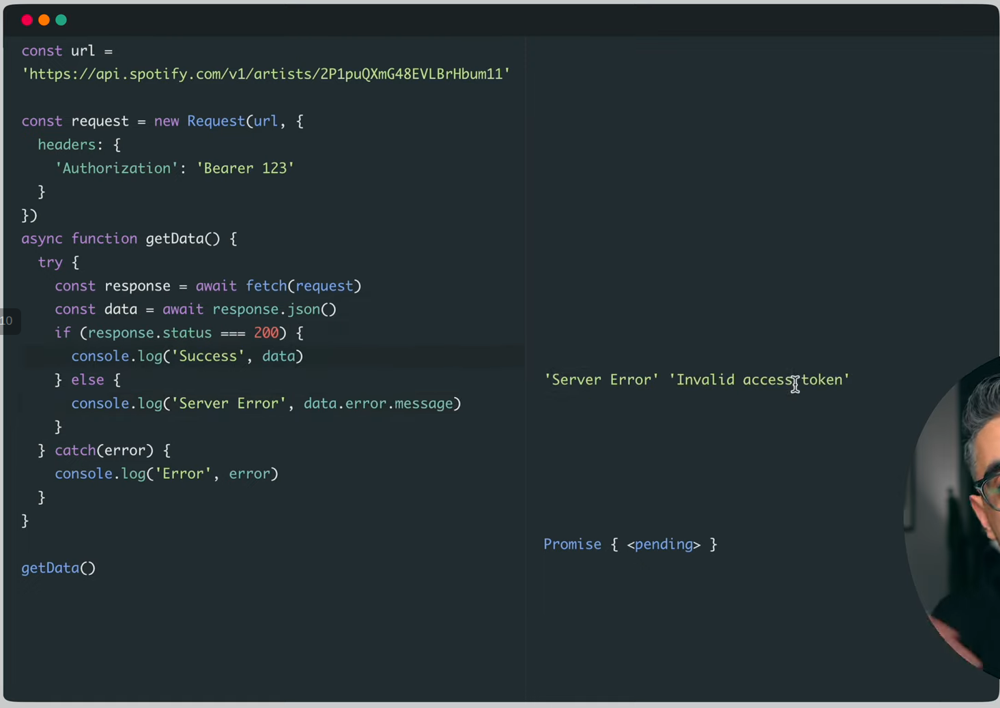

---

### ❌ Failed Fetch (Promise Rejected)
If the fetch itself fails (e.g., **no internet connection**, **CORS error**, or **server unreachable**),  
then the **`catch` block will run**.

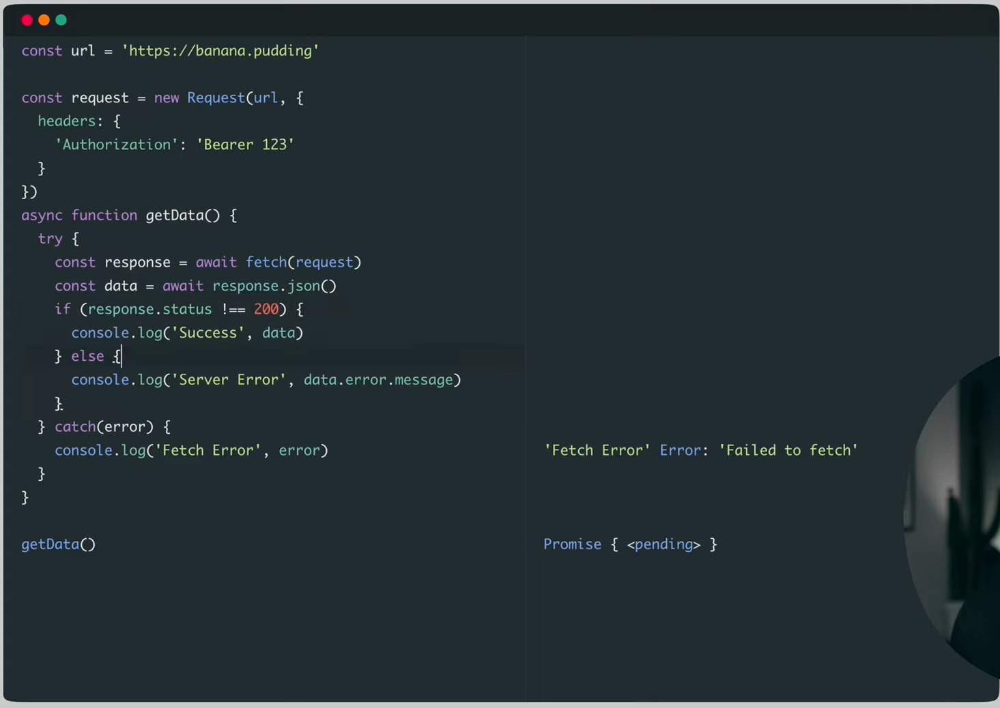

---

### 📤 POST Requests
`POST` is generally used to **send data to the server**, such as submitting forms or uploading data.

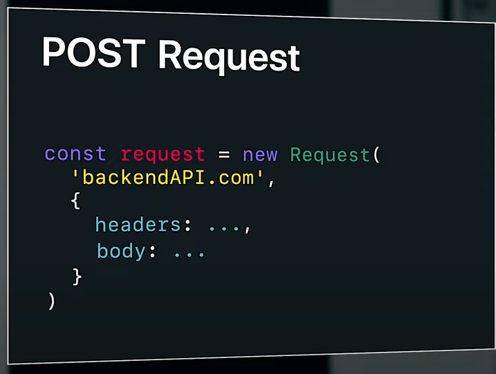

<br>


## JS closure

* Closure = inner function + access to outer variables.

* Variables stay alive as long as the inner function is referenced.

* Common use cases: data privacy, counters, function factories, etc.
``` js
function createCounter(init) { // init param will be remembered, even after the function finishes execution.
  let currentValue = init; // this as well
  return {
    value: currentValue,
    increment: _ => ++currentValue, // inner function
    decrement: _ => --currentValue,
    reset: _ => {
      currentValue = init;
      return currentValue;
    },
  }
}

let counter1 = createCounter(10); 
let counter2 = createCounter(5);
let counter3 = createCounter(1);
// so here each counter still remembers it's init value, even after manipulation. for example:
counter1.increment(); // 11
counter1.increment(); // 12
counter1.reset(); // 10, so here it remembers the init value, cause it's kept somewhere in the memory.
```


### closure with constructor function (or class)

* it doesn't work the same way with constructor..

``` js
class Person {
  constructor(name) {
    let name = name; // won't work (won't be remembered if I use it with a method)
  }
  myMethod() {return name} // won't work, instead you should assign it to this.name = name.
                           // then access it in myMethod like this
  myMethod2() {return this.name};
} 
```
* so the bottom line, closure doesn't word the same way with constructor

### However it's gonna work that way: 

``` js 
class Person {
  constructor(name) {
    let secret = "hidden";
    this.getSecret = () => secret; // closure keeps secret alive
  }
}
```

<br>
<br>


## JavaScript Value vs. Reference (Primitives vs. Objects) 

* For primitives → the value is the actual data.
* For objects → the value is a reference (memory address).
* Passing primitives to a function

```js
let x = 10;

function change(num) {
  num = 20;
}

change(x);
console.log(x); // ❌ still 10
//num gets a copy of the value 10.
//Changing num does not affect x.
```


* There is no way to directly pass a primitive “by reference” in JavaScript (unlike cpp) .
* Passing objects (by reference value)


```js
let obj = { value: 10 };

function change(o) {
  o.value = 20;  // modifies the same object
}

change(obj);
console.log(obj.value); // ✅ 20
```

* However Reassigning the parameter (does NOT affect original)

```js
let obj = { value: 10 };

function change(o) {
  o = { value: 20 }; // reassigns local reference
}

change(obj);
console.log(obj.value); // ❌ still 10

```


* Non-primitive types (objects, arrays, functions) <br> 
  When you assign or pass them around, you’re copying the reference, not the whole object.
* Stack → variable names + references
* Heap → actual objects, arrays, functions
* Copying an object variable → copies reference, not object
* Mutating object → affects all references
* Reassigning variable → breaks the link


## Pure function

A pure function in JavaScript is a function that:
  * Always gives the same output for the same input.
  * Does not cause side effects — it doesn’t change anything outside its scope (like variables, DOM, console, files, etc.).
<hr>


Why pure functions are important

* ✅ Predictable and easy to test
* ✅ Easier to debug (no hidden changes)
* ✅ Reusable and composable (especially in functional programming)
* ✅ Safe for concurrency / async logic


## first-class functions 

🔹 Definition

In JavaScript, functions are first-class citizens (or first-class objects).
That means functions are treated like any other value — just like numbers, strings, or objects.

You can:
* Store them in variables.
* Pass them as arguments to other functions.
* Return them from other functions.
* Store them in objects or arrays.
* Basically — functions are data.


##
<br>
<br>
<br>
<br>
<br>
<br>
<br>
<br>
<br>


# 📝Side Notes
some general notes, kinda off-topic.

* ## Object Iteration

### 1. `for...in`
Iterates over **keys** (property names) in an object.

    const user = { name: "Ahmed", age: 21 };

    for (const key in user) {
      console.log(key);         // "name", "age"
      console.log(user[key]);   // "Ahmed", 21
    }

---

### 2. `Object.keys()`
Returns an **array of keys** → allows using array methods like `forEach`.

    Object.keys(user).forEach(key => {
      console.log(key, user[key]);
    });

---

### 3. `Object.values()`
Returns an **array of values**.

    Object.values(user).forEach(value => {
      console.log(value);
    });

---

### 4. `Object.entries()`
Returns an **array of [key, value] pairs**.

    Object.entries(user).forEach(([key, value]) => {
      console.log(`${key}: ${value}`);
    });

* ## Numbers Notes
| **Value**                  | **Meaning**                                       | **Example**                             |
| -------------------------- | ------------------------------------------------- | --------------------------------------- |
| `Infinity`                 | Positive infinity (bigger than any number)        | `1 / 0 → Infinity`                      |
| `-Infinity`                | Negative infinity (smaller than any number)       | `-1 / 0 → -Infinity`                    |
| `Number.MAX_VALUE`         | Largest finite number (\~1.79 × 10³⁰⁸)            | `console.log(Number.MAX_VALUE)`         |
| `Number.MIN_VALUE`         | Smallest positive number (>0, very close to zero) | `console.log(Number.MIN_VALUE)`         |
| `Number.POSITIVE_INFINITY` | Same as `Infinity`                                | `console.log(Number.POSITIVE_INFINITY)` |
| `Number.NEGATIVE_INFINITY` | Same as `-Infinity`                               | `console.log(Number.NEGATIVE_INFINITY)` |
| `NaN`                      | "Not a Number" (invalid math result)              | `0 / 0 → NaN`                           |
| `Number.isFinite(x)`       | Checks if `x` is finite (not ±Infinity, not NaN)  | `Number.isFinite(42) → true`            |


<br>
<br>
<br>
<br>

* hoisting doesn't work with arrow functions
<br>
<hr>

* JavaScript gives strings methods like .toUpperCase() or .slice(), but under the hood, those methods return new strings — they don’t modify the original.

* ## Primitive VS non-primitive
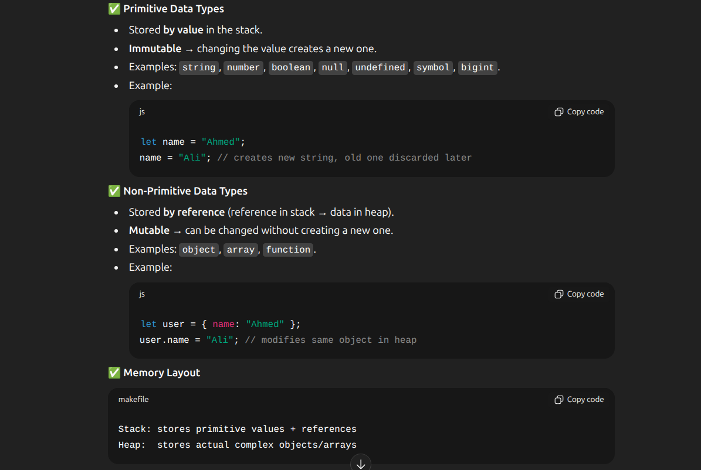

* if You confused when to use () with functions and when don't. <br>
  let myVar = myFunction -> the function itself <br>
  let myVar = myFunction() -> the returned value of the function

* Refresher: The different btw let i in arr VS let i of arr... <br>
  in -> index <br>
  of -> value

  


